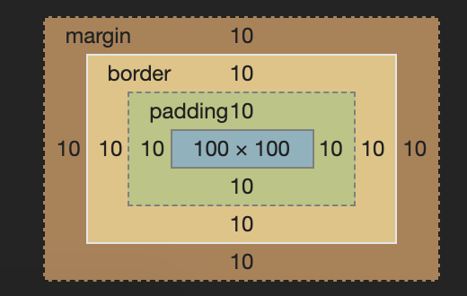
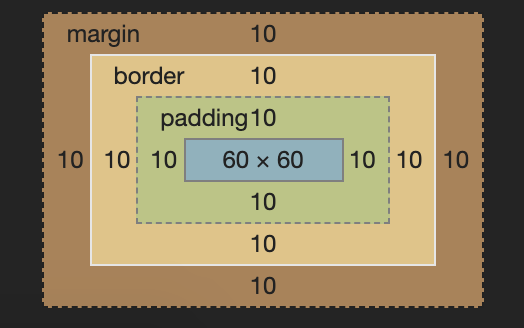

# box-model (css盒模型)

## 是什么

这次来补充一下基础知识，了解一下css盒模型。

在文档进行布局的时候，浏览器会把所有的元素绘制成矩形盒子。而每个盒子则有4部分组成，分别是
- Content 内容
- Padding 内边距
- Border 边框
- Margin 外边距

然后其中的每一项都有对应的css属性影响。大致的情况如下
- Content => width, height 之类
- Padding => padding 之类
- Border => border 之类
- Margin => marign 之类

> 之类说的是各种上下左右的方向等。

## box-sizing

### content-box

而这其中比较重要常用的`box-sizing`这个属性，可以设置宽度和高度的计算方式。

默认情况下`content-box`，宽度只包含`内容`部分的宽度。

比如这样

```css
#div1 {
  width: 100px;
  height: 100px;
  padding: 10px;
  margin: 10px;
  border: 10px solid blue;
  background-color: lightblue;
}
```

宽度设置了`100px`只影响内容，因为其他的属性影响，最终看到的会比`100px`大很多。



### border-box

而如果把`box-sizing`设置为`border-box`的话则会改变计算方法。宽度高度将会影响`内容`+`内边距`+`边框`

```css
#div2 {
  box-sizing: border-box;
  width: 100px;
  height: 100px;
  padding: 10px;
  margin: 10px;
  border: 10px solid red;
  background-color: lightcoral;
}
```

比如这样设置之后，可以看到内容的宽度被压小了只剩`60px`，但是最终看到的宽度还是`100px`。



> 当然无论哪种设置，外边距都是不包含在内的。

### 其他影响

除了对直接视觉上的影响，还会影响一些从JS中取得的DOM属性。

比如`clientHeight`这个属性，包含了`内容和内边距`，对比两种不同的`box-sizing`设置，分别是

- `content-box` 120 => 内容100px + 内边距20px
- `border-box` 80 => 内容60px + 内边距20px

## 总结

一般来说使用`border-box`更符合人类的直观感受，也比较便于布局。

## 参考

- [Introduction to the CSS basic box model](https://developer.mozilla.org/en-US/docs/Web/CSS/CSS_Box_Model/Introduction_to_the_CSS_box_model)
- [box-sizing](https://developer.mozilla.org/en-US/docs/Web/CSS/box-sizing)
- [相关代码](../../code/CSS/box-model.html)