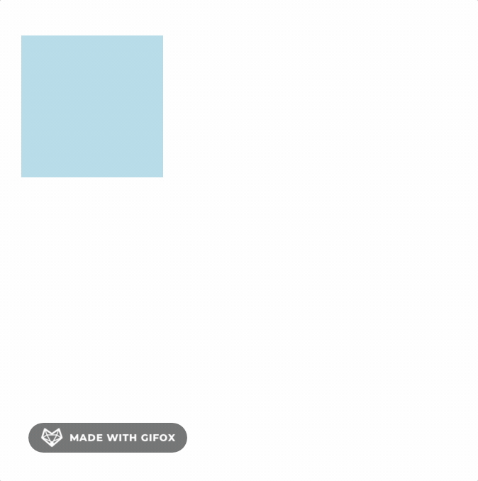
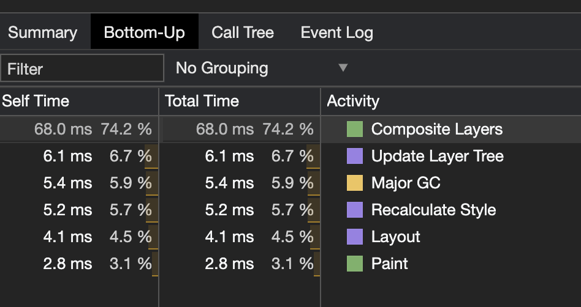
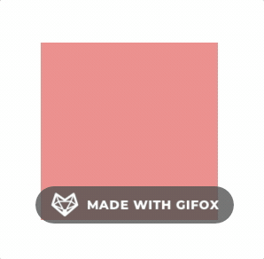
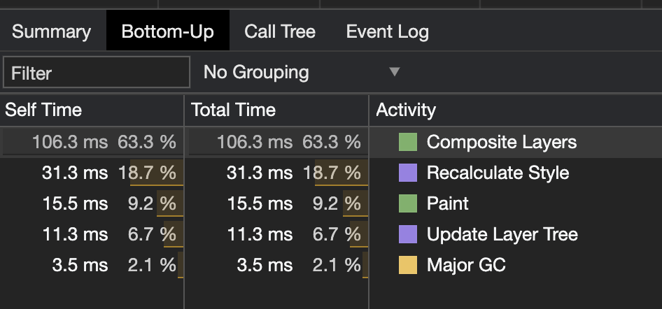
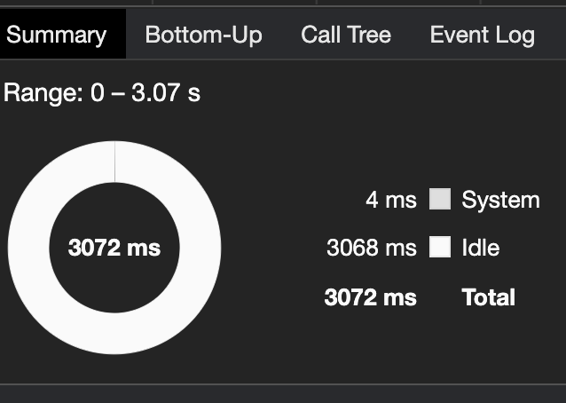

# css-trigger-render (css对于重排/回流以及重绘的影响)

## 是什么

我们这里先来了解一下网页是如何生成的，这部分内容主要参考的是阮一峰的[网页性能管理详解](http://www.ruanyifeng.com/blog/2015/09/web-page-performance-in-depth.html)。

网页的生成过程，大致可以分成五步。

1. HTML代码转化成DOM
2. CSS代码转化成CSSOM（CSS Object Model）
3. 结合DOM和CSSOM，生成一棵渲染树（Render Tree）
4. 生成布局（Layout），即将所有渲染树的所有节点进行平面合成
5. 将布局绘制（Paint）在屏幕上

---


---

生成布局和绘制布局这两步都属于**渲染（Redner）**，除了第一次一定会执行一次整个过程，还有一些情况会导致网页重新渲染。

重新渲染包括重新生成布局(Reflow)以及重新绘制(Repaint)。

> Reflow一些地方叫回流一些地方叫重排，是一样的东西，认准英文就好。

然后两个基本的知识就是
- `Reflow`一定会导致`Repaint` -> 比如移动了某个元素的位置
- `Repaint`不一定导致`Reflow` -> 比如只改变了某个元素的颜色

简单的理解一下就是布局肯定要确定位置，所以位置有变化肯定要重新布局，然后布局完了再绘制出来。
而如果只变颜色位置就不会变化，那么布局肯定就不会变，所以只需要绘制。

好了那么本次的分享到此结束，大家再见 —— 个鬼啦，只知道理论不实际用代码实现出来我是不会接受的。

## 实现

我们刚刚知道了`移动位置`之类的操作会导致触发重绘与重排。那么我们首先来写一个css动画试试。

```html
<!DOCTYPE html>
<html lang="en">
<head>
  <meta charset="UTF-8">
  <meta name="viewport" content="width=device-width, initial-scale=1.0">
  <title>Document</title>
  <style>
    #div {
      animation: position-movement 3.2s infinite;
      position: absolute;
      left: 50px;
      top: 50px;
      height: 100px;
      width: 100px;
      background-color: lightblue;
    }
    @keyframes position-movement {
      0% {
        left: 50px;
        top: 50px;
      }
      25% {
        left: 250px;
        top: 50px;
      }
      50% {
        left: 250px;
        top: 250px;
      }
      75% {
        left: 50px;
        top: 250px;
      }
    }
  </style>
</head>
<body>
  <div id=div></div>
</body>
</html>
```

我们用定位的方式做了一段简易的css动画，大概长这样。



然后根据我们的知识我可以知道，这个动画应该是会同时触发重绘和重排的，于是我们打开`chrome`开发者工具的`performance`栏测试一下。



我们可以看到确实存在排列/布局(Layout)和绘制(Paint)过程。

然后我们再来尝试一个对于背景颜色的变化的动画。

```css
@keyframes background-animation {
  0% {
    background-color: lightblue;
  }
  25% {
    background-color: lightcoral;
  }
  50% {
    background-color: lightseagreen;
  }
  75% {
    background-color: lightsalmon;
  }
}
```

看上去是这样。



然后因为他只改变了颜色，理论上只会触发重绘，不触发重排，让我康康控制台是不是这样。



可以看到，确实里面没有Layout这一栏，意味着浏览器没有进行布局行为，到这里我们总算是放心了。

然而，另外还有一种效果，可以既不触发重绘也不触发重排 —— 还有这种好事？

我们把第一个动画稍微改一种写法，效果不变。

```css
@keyframes transform-movement {
  0% {
    transform: translate(0, 0);
  }
  25% {
    transform: translate(200px, 0);
  }
  50% {
    transform: translate(200px, 200px);
  }
  75% {
    transform: translate(0, 200px);
  }
}
```

然后同样的去看看控制台，发现居然什么也没有！？



这是因为浏览器针对一部分css动画进行了优化，使得动画在GPU的帮助下不需要经过经过上述那些步骤，包括比如`<video>`, `<canvas>`之类的标签也是如此, 具体的内容在这里就不展开了，总而言之有一部分css属性是不会触发重绘重排的，积极的使用他们吧。

然后在[这个网站](https://csstriggers.com/)可以看到css属性对页面渲染的影响。

## 参考

- [你真的了解回流和重绘吗](https://github.com/chenjigeng/blog/blob/master/%E4%BD%A0%E7%9C%9F%E7%9A%84%E4%BA%86%E8%A7%A3%E5%9B%9E%E6%B5%81%E5%92%8C%E9%87%8D%E7%BB%98%E5%90%97.md)
- [网页性能管理详解](http://www.ruanyifeng.com/blog/2015/09/web-page-performance-in-depth.html)
- https://csstriggers.com/
- [CSS performance optimization](https://developer.mozilla.org/en-US/docs/Learn/Performance/CSS)
- [相关代码](../../code/CSS/css-trigger-render.html)