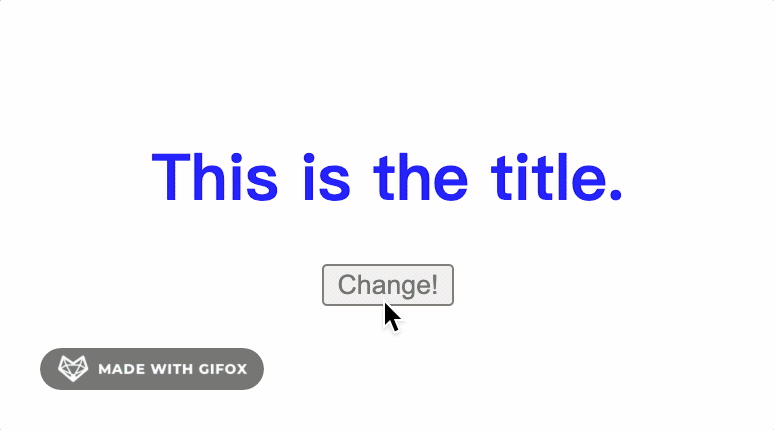

# theme (切换主题)

## 是什么

这次就来写一个炫酷（并不）的切换主题效果吧。

## 思路整理

其实很简单，我们这里使用[`css变量`](https://developer.mozilla.org/en-US/docs/Web/CSS/Using_CSS_custom_properties)来达到效果。

当需要不同的主题时，给`body`设置上不同的`className`就好了。

## 实现

于是我们先来无视配色的设置3种主题吧。

```css
.theme1 {
  --background: white;
  --title: blue;
  --btn: dimgray;
}

.theme2 {
  --background: lightblue;
  --title: black;
  --btn: red;
}

.theme3 {
  --background: wheat;
  --title: darkcyan;
  --btn: darkorchid;
}
```

然后再写一些`html`标签。

```html
<body>
  <div class="container">
    <h1 class="title">
      This is the title.
    </h1>
    <button onclick="change()" class="btn">Change!</button>
  </div>
</body>
```

给他们加一些样式。

```css
html, body {
  height: 100%;
  margin: 0;
}

body {
  background-color: var(--background);
  transition: .2s;
}

.container {
  height: 70%;
  display: flex;
  flex-direction: column;
  justify-content: center;
  align-items: center;
}

.container .title {
  color: var(--title);
}

.container .btn {
  color: var(--btn);
}
```

我们拥有了一个标题和一个按钮，颜色部分使用变量的方式去写，然后我们希望点击按钮的时候会产生一些变化，就是说在3个主题中依次切换，于是我们对点击事件加一些方法。

```js
let index = 1
// 设置为当前序号的主题，再设置序号到下一个
function change () {
  // 把body加上对应的class名，对应的变量就会生效
  document.body.className = `theme${index}`
  index = index < 3 ? ++index : 1
}

// 默认加载第一个主题
change()
```

然后最终的效果看上去是这样！



可喜可贺。

## 总结

这次试用css变量简单的实现了一个主题效果，那么就是这样。

## 参考

- https://zocada.com/dark-and-light-theme-switcher-using-css-variables-and-pure-javascript/
- [相关代码](../../code/CSS/theme.html)