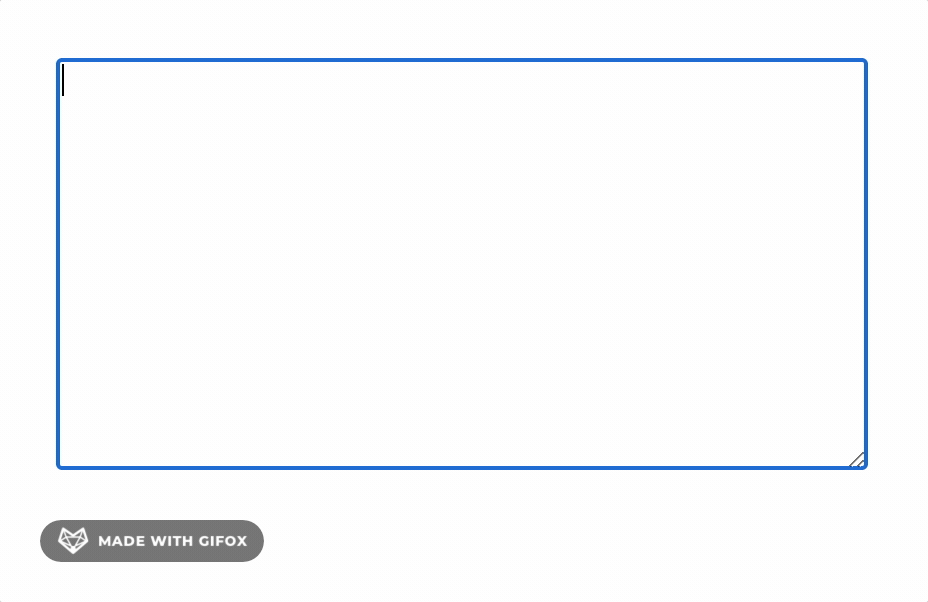

# caret-position (获取输入框中的光标位置)

## 是什么

比如在一些SNS网站，按一下@就会出现人员列表的那种下拉框，明显是获得了光标的位置再进行定位，这次就来实现一下这个效果吧。

## 准备

首先先来创建一个空文档，准备一个`textarea`输入框和定位标识文字。

```html
<!DOCTYPE html>
<html lang="en">
<head>
  <meta charset="UTF-8">
  <meta name="viewport" content="width=device-width, initial-scale=1.0">
  <title>Document</title>
  <style>
    html, body {
      height: 100%;
    }
    body {
      display: flex;
      justify-content: center;
      align-items: center;
    }
    #textarea {
      width: 400px;
      height: 200px;
    }
    #behind-you {
      position: absolute;
      left: 0;
      top: 0;
    }
  </style>
</head>
<body>
  <textarea id="textarea"></textarea>
  <span id="behind-you">我在你后面(￣▽￣)</span>
</body>
</html>
```

好了，接下来我们希望我们在`textarea`中输入内容时，定位的文字会跟在光标后面。

## 思路整理

很遗憾到目前为止没有可以直接获得光标位置的方法，所以我们只能使用比较诡异的措施，比如我们把输入框里的内容原封不动的生成`html`，那么是不是就可以通过`DOM`元素获得定位了。而比如`pre`标签则可以保存完整的输入格式，而光标我们就假装用一个字符`|`去表示好了。

## 实现

为了保证在打一个字之后触发效果，我们首先监听`textarea`的`input`事件，然后在监听到之后通过某个方法获得光标相对于屏幕的`left`, `top`再设置需要的元素就好了。

```js
const textareaDOM = document.getElementById('textarea')
const behindDOM = document.getElementById('behind-you')

textareaDOM.addEventListener('input', () => {
  const { left, top } = getpos(textareaDOM)

  behindDOM.style.left = left + 'px'
  behindDOM.style.top = top + 'px'
})

function getpos () {
  // ...
}
```

然后就是实现`getpos`这个方法。

从上面的思路中得知，我们首先需要一个`pre`DOM元素以及一个`span`DOM元素，然后因为`getpos`这个方法可能触发的非常频繁，每次创建新的DOM肯定不合适，于是我们先做一个简单的缓存。

```js
const MirrorMap = new WeakMap()
function getpos (dom) {
  let pre, span
  // 如果有创建过对应DOM就使用以前的，否则就创建新的
  if (MirrorMap.has(dom)) {
    [pre, span] = MirrorMap.get(dom)
  } else {
    [pre, span] = initializeDOM(dom)
    MirrorMap.set(dom, [pre, span])
  }

  // ...
}
```

然后创建新DOM的时候，我们先设定几个一定会有的属性。

```js
function initializeDOM (dom) {
  const pre = document.createElement('pre')
  const span = document.createElement('span')

  pre.style.wordBreak = 'break-all'
  pre.style.whiteSpace = 'pre-wrap'
  pre.style.position = 'fixed'
  pre.style.zIndex = '-9999'
  pre.style.left = '-9999px'
  span.textContent = '|'

  return [pre, span]
}
```

然后我们需要设置一下`pre`和`span`的字体大小，毕竟本身的输入框的文字大小不确定。

另外固定一下`pre`的宽度，让他能换行。

```js
const domStyle = getComputedStyle(dom)
pre.style.width = domStyle.width
pre.style.fontSize = domStyle.fontSize
span.style.fontSize = domStyle.fontSize
```

然后就是重要的一步了，我们需要把输入框中**到光标为止**的内容放入`pre`中，然后再把`span`插入到内容最后。

```js
pre.textContent = dom.value.slice(0, dom.selectionEnd) + ' '
pre.appendChild(span)
```

然后为了获取此时`span`的位置，我们需要先把他们插入到文档中，然后获取位置之后也不需要继续保留了再从文档中移除。

然后需要返回的结果应该是`span`相对于`pre`的位置，加上传入的DOM相对于屏幕的位置。

```js
// getpos
// ...

  dom.parentNode.appendChild(pre)

  const result = {
    left: dom.offsetLeft + span.offsetLeft,
    top: dom.offsetTop + span.offsetTop,
  }

  dom.parentNode.removeChild(pre)

  return result
}
```

然后我们去页面上随便打打字试一下，事实上已经实现了让内容跟随光标的效果，但是如果超过`textarea`高度出现滚动条则会有问题，所以我们还需要在`top`处减去滚动条顶部的高度。但是遗憾的是在`input`事件内我们无法直接获得最新的滚动条的高度，因为那个时候滚动条还没有被挤下来，我们不得不在这里加一个异步让他能够获取到正确的高度。

```js
// ...

return new Promise(resolve => {
  setTimeout(() => {
    result.top -= dom.scrollTop
    resolve(result)
  })
})
```

然后在使用的地方也改为异步。

```js
// ...

textareaDOM.addEventListener('input', async () => {
  const { left, top } = await getpos(textareaDOM)
  behindDOM.style.left = left + 'px'
  behindDOM.style.top = top + 'px'
})
```

好了，到现在为止至少在`input`事件下看上去没什么问题了，让我们来看一下最终的效果。



其实在一些细节的地方还有待优化，不过反正原理大概就是如此真正如果有需要的话可以去参考[现有的库](https://www.npmjs.com/search?q=caret%20)或者自己写一个！

## 参考

- https://github.com/deshiknaves/caret-pos
- [相关代码](../../code/HTML/caret-position.html)