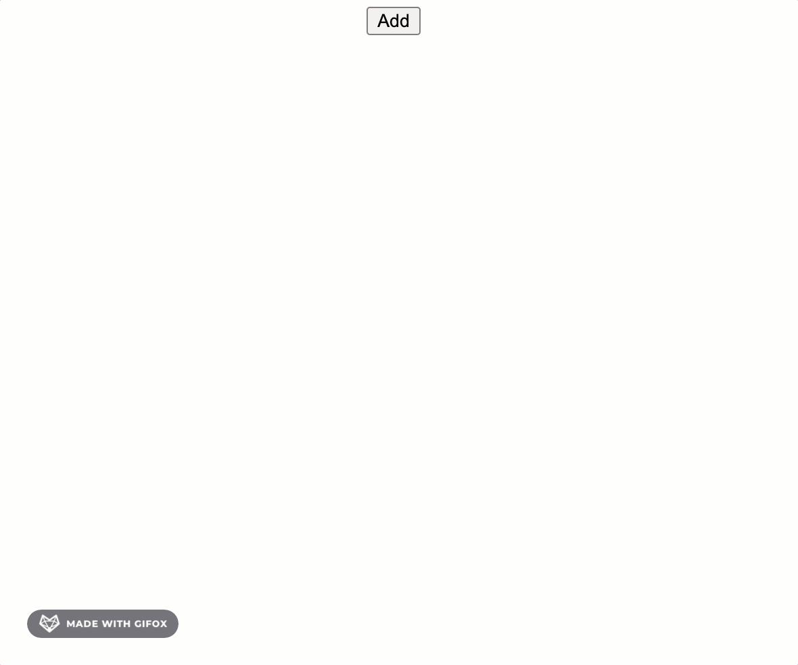

# waterfall (瀑布流效果)

## 是什么

瀑布流就是许多宽度相同高度不同的元素排列，一般在网站上经常能看到，这次来实现一个简单的瀑布流效果吧。

## 思路整理

如果单纯的靠元素一个个排列的话是很难让元素在垂直方向插入其他几个元素中间的，所以这里我们使用**定位**来实现。

定位需要的条件是`left`和`top`，比如一共有`n`列瀑布，那么我们需要的就是记录每一列瀑布的顺序，以及记录下每一列瀑布的高度，顺序用来控制`left`，高度用来控制`top`。

所以按照这个思路创建一个长度为`n`的数组，每一个元素记作当前列瀑布的高度即可。

```
[第一列瀑布高度, 第二列瀑布高度, ... , 第n列瀑布高度]
```

## 开始实现

为了方便演示，我们这里就做一个点击按钮往对应区域加元素的效果把。

```html
<body>
    <button id="btn">Add</button>
    <br>
    <div id="container">
    </div>
</body>
```

然后来设定一些初始值

```js
// 每条瀑布的宽度
const WIDTH = 100
// 每个元素的间距
const GAP = 5
// 记录每条瀑布高度的数组，暂定一共5条
const TOPS = Array(5).fill(0)
```

然后每当我们点击按钮时，就往其中某一条瀑布插入一个元素，我们先写出结构框架，大概是这样。

```js
document.getElementById('btn').onclick = () => {
    // 获取插入的瀑布位置
    const index = getIndex()
    // 随机生成一个高度
    const height = randomHeight()
    // 根据位置和高度生成一个新元素
    const elem = createElement(index, height)

    // 向容器内插入一个新元素
    document.getElementById('container').append(elem)
    // 更新对应瀑布的高度
    TOPS[index] += height + GAP
}

function getIndex() {
}

function createElement(index) {
}

function randomHeight () {
}
```

把每一个函数的职责区分开来，并且让他们尽可能的**纯**。

然后接下来就是一个个实现对应的函数，首先是获取插入位置，根据瀑布流的特性，我们知道是每次往最短的那一条插入，所以可以通过我们之前维护的数组轻松的获取到。

```js
function getIndex() {
    return TOPS.indexOf(Math.min(...TOPS))
}
```

之后我们要根据这个位置去确定给新元素的定位位置然后插入，在那之前我们先随机生成一个差不多的高度吧。

```js
function randomHeight () {
    const [min, max] = [80, 200]
    return Math.floor(Math.random() * (max - min)) + min
}
```

之后根据上面获取到的属性创建一个DOM节点。

```js
function createElement(index, height) {
    const node = document.createElement('div')

    node.className = 'item'
    node.textContent = `${WIDTH} x ${height}`
    node.style.width = WIDTH + 'px'
    node.style.height = height + 'px'
    node.style.left = index * (WIDTH + GAP) + 'px'
    node.style.top = TOPS[index] + 'px'

    return node
}
```

基本也就是根据参数设置一下宽高，然后定位位置之类的。

好了最后我们加一点样式让他们看上去明显一点，来试试看。


看上去不错，于是我们再尝试加一点效果让他更好看。



嗯...好像也不是很好看，不过总而言之就是这样了，完成了！

## 总结

总而言之这次学习到了瀑布流可以通过定位加上记录瀑布高度来实现，倒也是比较简单，以上。

## 参考

- [相关代码](../../code/HTML/waterfall.html)