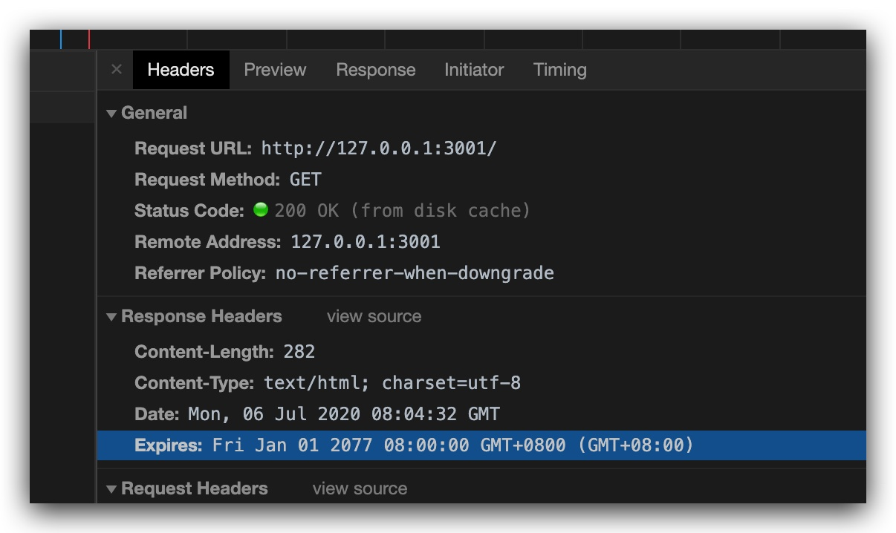
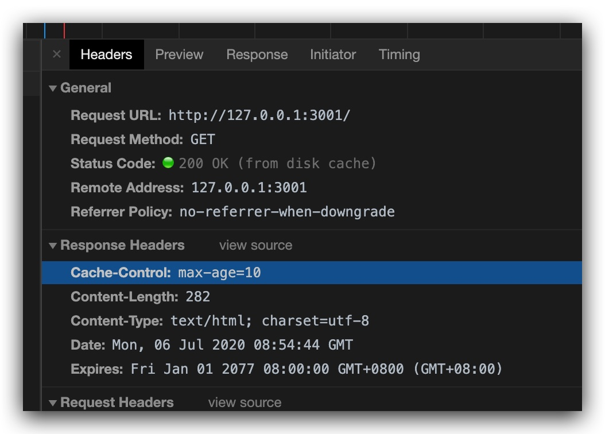
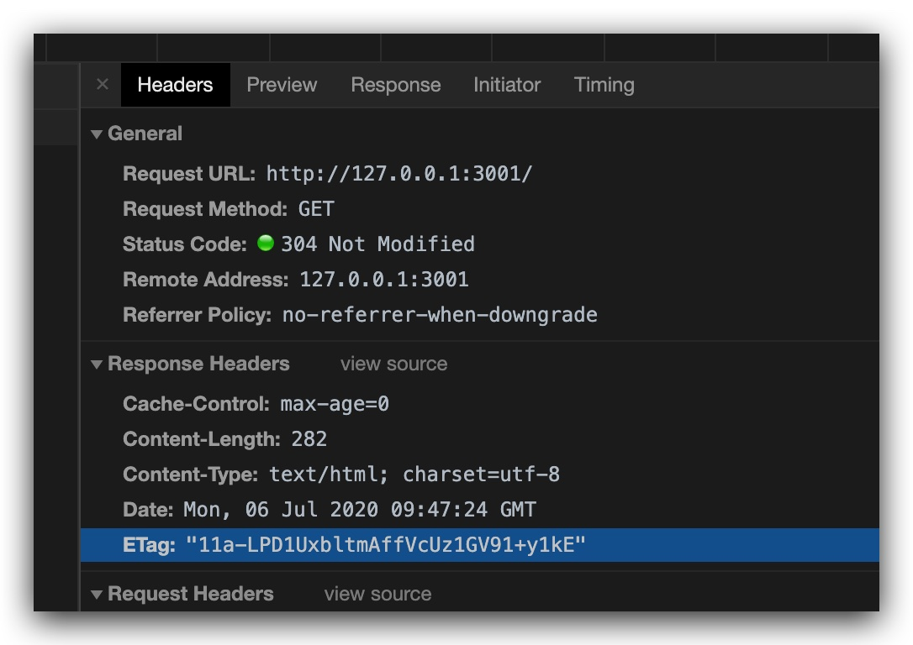
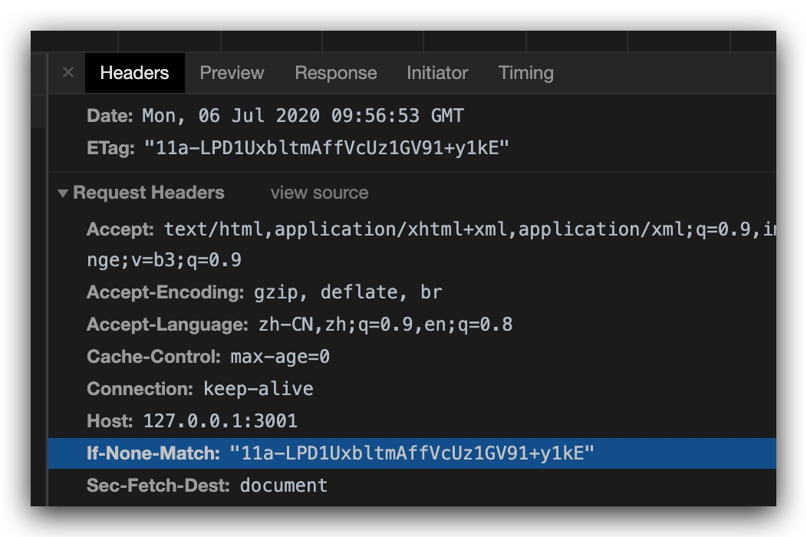

# brwoser-cache (浏览器缓存)

## 是什么

我们都知道浏览器在发出一次`HTTP`请求后都会用各种方式缓存，于是这次就来尝试一下。

## 准备 

首先我们用`Node`的[`http`](https://nodejs.org/api/http.html)模块来创建一个特别干净的`HTTP`服务。

> index.js

```js
'use strict'

const http = require('http')
const fs = require('fs')
const path = require('path')

const server = http.createServer((req, res) => {
  res.setHeader('Content-Type', 'text/html; charset=utf-8')

  res.end(
    fs.readFileSync(path.join(__dirname, 'index.html'))
  )
})

server.listen('3001', () => {
  console.log('sever run on http://127.0.0.1:3001')
  require('child_process').exec('open http://127.0.0.1:3001')
})
```

> index.html

```html
<!DOCTYPE html>
<html lang="en">
<head>
  <meta charset="UTF-8">
  <meta name="viewport" content="width=device-width, initial-scale=1.0">
  <title>Document</title>
</head>
<body>
  This is a Node server demo
</body>
</html>
```

然后我们访问链接，切换到`NetWork`处仅仅只有以下几个`Header`

```
Connection: keep-alive
Content-Length: 223
Content-Type: text/html; charset=utf-8
Date: Mon, 06 Jul 2020 07:08:22 GMT
```

## 开始尝试

先来整理一下缓存的过程，假设浏览器发起了HTTP请求，首先先会去检查浏览器自己有没有可使用的缓存，如果没有的话就会去请求服务器，看服务器对应的资源有没有发生变化，如果返回的是304之类的就代表内容没有变化，则浏览器还是从浏览器自己这边取得缓存，如果有变化则服务器返回新的内容，浏览器请求到新的内容之后再加入缓存之中。

从不可告人的地方拿到了一张图可能更为直观。


以上均为学习过程中得出的结论，仅仅为个人理解不一定完全标准，具体参考的文章参考最下。

把不用请求服务器的缓存姑且称之为[`强制缓存`](#强制缓存)，把需要请求服务器判断资源是否变化的缓存姑且称之为[`协商缓存`](#协商缓存)。

### 强制缓存

这种缓存是直接从浏览器缓存查找结果，完全不用请求服务器，哦哦！

有两种方式来达成，首先是[`Expires`](https://developer.mozilla.org/en-US/docs/Web/HTTP/Headers/Expires)，虽然看上去似乎是旧时代的产物，不过我们也来尝试一下把。

#### Expires

我们先设置一个非常赛博朋克的时间

```js
// ...

res.setHeader('Expires', new Date('2077-01-01'))
```

然后注意强制缓存的`html页面`靠刷新，或者直接浏览器访问是不会读取的，需要靠其他链接跳转之类的来测试效果。所以我们稍微在原本页面上加入一个`a标签`

```html
<a href="http://127.0.0.1:3001">Click Me!</a>
```

然后我们不停的去点击`Click Me!`，可以看到`NetWork`那一栏加载的文件永远都是从缓存中读取的，完全没有访问服务器！



然后我们再设定一个古老的时间。

```js
// ...

res.setHeader('Expires', new Date('2000-01-01'))
```

然后疯狂的继续刚刚的操作，哦，他还是理所当然的去请求服务器，每次都返回`200`。

#### Cache-Control

然后则是[`Cache-Control`](https://developer.mozilla.org/en-US/docs/Web/HTTP/Headers/Cache-Control)，他的可设置内容就多一些了具体可以参考文档。

他和`Expires`一起设置的时候，优先级会比较高，是比较常用的控制缓存的手段。

先来设置和`Expires`相似的`max-age`属性。

```js
// ...

res.setHeader('Cache-Control', 'max-age=10')
```

这个意思是把内容强制缓存10秒钟，于是我们来尝试一下，刷新之后点击链接。



这里和上面`Expires`设置的缓存效果一样，也是直接通过缓存就得到请求了，没有访问服务器。然后等了10秒钟之后再点击的第一次，就也会像普通的访问一样返回`200`了。

另外我们这里可以看到我们触发的全部都是`disk cache`缓存，还有一种`memory cache`这个是由浏览器自行判断使用哪种的，那方面的知识我们就不展开啦。

### 协商缓存

可以看到上面的内容都是完全不经过服务器就去判断的缓存，那么有没有一种去判断如果内容有变化则加载新的不变就加载旧的的缓存呢，没错，这个时候就需要用到了协商缓存。

协商缓存在强制缓存失效后执行，用到了`Last-Modified / If-Modified-Since`和`Etag / If-None-Match`这两种响应头，`Etag`的优先级也较高，为了方便实现我们这里就先用`Etag`来进行尝试吧。

#### Etag / If-None-Match

我们先引入一个`etag`库，然后对我们的`html`文件生成标识。

```js
// ...
const etag = require('etag')
const body = fs.readFileSync(path.join(__dirname, 'index.html'))
const serverTag = etag(body)
```

然后在服务端设置`etag`之后，如果发现和前端的`if-none-match`对比之后一样说明内容没有变化，则返回`304`状态码。

```js
// ...
res.setHeader('ETag', etag(body))

if (req.headers['if-none-match'] === serverTag) {
  res.statusCode = 304
  res.end()
} else {
  res.end(body)
}
```

然后这个时候再多次刷新页面，返回的都是`304`状态码，虽然没有服务器没有返回实体内容，但是浏览器还是存缓存中读取了上次的内容并展示在了页面上。




> 协商缓存普通的刷新可以生效，而强制刷新则不会生效，强制刷新首先就不会带上`If-None-Match`请求头，当然也就无从比较了。

然后在修改`index.html`文件之后，生成出的`ETag`也随之变化，下次刷新时状态码会是`200`，普通请求资源。下下次刷新则又变为`304`。

#### Last-Modified / If-Modified-Since

`Last-Modified`和上面的`Etag`原理差不多，每次响应头`Last-Modified`会缓存在浏览器，然后下次请求的时候`If-Modified-Since`会作为请求头传到服务器，值为`Last-Modified`的值，如果在服务器端判断`Last-Modified`大于`If-Modified-Since`则认为文件已经变化，则返回`200`状态码以及内容，否则返回`304`。

如果和`Etag`同时存在，`Etag`的优先级会更高。

另外`Last-Modified`的时间会受到本地的修改以及只能以秒计，所以之后出现了`Etag`的更准确的缓存。不过`Last-Modified`的性能会比`Etag`更好，毕竟不用根据文件内容生成减少了计算过程。

## 总结

总而言之浏览器会先考虑使用强制缓存，当强制缓存不成功的时候会尝试协商缓存。另外根据观察，在F5刷新，跳转链接，强制刷新或者勾选了`Disable Cache`各种情况下请求头会不一样（主要是`Cache-Control`），所以也会因此影响一些缓存。

然后一般情况下，面对会经常变化的资源设置`Cache-Control: no-cache`，相当于不使用强制缓存，每次去服务器请求看文件是否变化。

然后面对不常变化的资源，会设置类似`Cache-Control: max-age=31536000`的超长强制缓存时间，然后文件后会加上一些动态的字符来区分版本，用来解决更新的问题。

## 参考

- https://www.jianshu.com/p/54cc04190252
- https://heyingye.github.io/2018/04/16/%E5%BD%BB%E5%BA%95%E7%90%86%E8%A7%A3%E6%B5%8F%E8%A7%88%E5%99%A8%E7%9A%84%E7%BC%93%E5%AD%98%E6%9C%BA%E5%88%B6/
- [相关代码](../../code/HTTP/browser-cache/index.js)