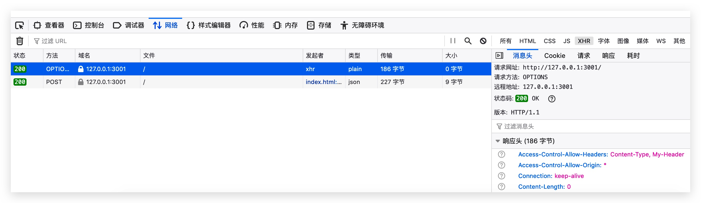

# cors (Cross-Orgin Resource Sharing)

## 是什么

跨域资源共享(CORS) 是一种机制，它使用额外的 HTTP 头来告诉浏览器  让运行在一个 origin (domain) 上的Web应用被准许访问来自不同源服务器上的指定的资源。当一个资源从与该资源本身所在的服务器不同的域、协议或端口请求一个资源时，资源会发起一个跨域 HTTP 请求。

完整参考[MDN](https://developer.mozilla.org/en-US/docs/Web/HTTP/CORS)。

## 目标

总而言之就来模拟并解决一个跨域问题吧。

## 基本实现

新建一个`HTML`页面，使用[`XMLHttpRequest`](https://developer.mozilla.org/en-US/docs/Web/API/XMLHttpRequest)发起一个`POST`请求。

```html
<script>

  request()
  function request () {
    const xhr = new XMLHttpRequest()

    xhr.open('POST', 'http://127.0.0.1:3001')
    xhr.setRequestHeader('Accept', 'application/json')
    // 假装取得json数据
    xhr.setRequestHeader('Content-Type', 'application/json');
    // 设定了自定义的Header
    xhr.setRequestHeader('My-Header', '123');
    xhr.onload = function (evt) {
      console.log(evt)
      console.log(xhr.response)
    }

    xhr.send()
  }
</script>
```

因为想要触发跨域请求，必须要满足一些条件，具体可以看底部链接的MDN里。所以我们假装要获取`json`数据并且设置了自定义的`header`。

然后在后台启动一个简单的服务。

```js
'use strict'

const http = require('http')

const server = http.createServer((req, res) => {
  console.log(req.method)

  // 如果是options类型的请求则返回空
  if (req.method === 'OPTIONS') {
    res.end()
  } else {
    res.setHeader('Content-Type', 'application/json')
    res.end(JSON.stringify({ a: 123 }))
  }
})

server.listen(3001, () => {
  console.log('sever run on http://127.0.0.1:3001')
})
```

然后我们刷新一下页面，发现控制台报错了（这里使用的是FireFox的报错信息看上去更为清晰）。

```
已拦截跨源请求：同源策略禁止读取位于 http://127.0.0.1:3001/ 的远程资源。（原因：CORS 头缺少 'Access-Control-Allow-Origin'）。  
已拦截跨源请求：同源策略禁止读取位于 http://127.0.0.1:3001/ 的远程资源。（原因：CORS 请求未能成功）。
```

然后我们同时也看到服务端的控制台里打印出了`OPTIONS`。

事实上请求成功的的发送了，并且也成功的返回了，但是被浏览器拦截了。

于是我们先尝试加上头`Access-Control-Allow-Origin`。

```js
  res.setHeader('Access-Control-Allow-Origin', '*');
```

然后前端的报错信息为如下所示。

```
已拦截跨源请求：同源策略禁止读取位于 http://127.0.0.1:3001/ 的远程资源。（原因：CORS 预检响应的 'Access-Control-Allow-Headers'，不允许使用头 'content-type'）。  
已拦截跨源请求：同源策略禁止读取位于 http://127.0.0.1:3001/ 的远程资源。（原因：CORS 请求未能成功）。
```

`Content-Type`头不符合要求，因为简单请求仅允许几种数据类型，而`json`是不被允许的，所以还要设置服务端的`Access-Control-Allow-Headers`。

```js
  res.setHeader('Access-Control-Allow-Headers', 'Content-Type, My-Header');
```

这里同时我们也把自定义的头加上去了，然后再来看看效果。

这个时候已经可以成功访问并得到结果了，切换到网络部分看一下。



可以看到发现在`POST`请求之前有一个预检验请求`OPTIONS`，但是随着多次刷新这个请求有时候有有时候没有，这个其实是根据`Access-Control-Max-Age`这个响应头控制的，在不设置的情况下，看上去会默认有一个，我们尝试设置一个10。

```js
  res.setHeader('Access-Control-Max-Age', '10');
```

然后我们刷新页面，第一次还是会发送预检验请求，然而之后的10秒内就不会再发送了。

服务端的控制台打印出的结果是类似这样。

```
OPTIONS
POST
POST
POST
POST
OPTIONS
POST
POST
POST
```

他决定了预检验请求的有效时间。

再如果想要用一些除了`GET`,`POST`以外的请求方法，比如`PATCH`，则需要在响应头再设置`Access-Control-Allow-Methods`。

```js
  res.setHeader('Access-Control-Allow-Methods', 'POST, GET, OPTIONS, PUT, PATCH');
```

这些决定了允许跨域的方法，所以总体上的设置大概是像这样。

```js

  // 当然这里也可以设置成客户端的地址
  res.setHeader('Access-Control-Allow-Origin', '*');
  res.setHeader('Access-Control-Allow-Headers', 'Content-Type, My-Header');
  res.setHeader('Access-Control-Allow-Methods', 'POST, GET, OPTIONS, PUT, PATCH');
  res.setHeader('Access-Control-Max-Age', '10');

```

## 设置Cookie

如果是跨域请求，则默认不会把`cookie`带上，需要设置跨域认证，这个需要前后端配合实现，首先前端的话如果是使用`XMLHttpRequest`则需要设置`withCredentials`属性。

```js
// ...
xhr.withCredentials = true
```

然后后端要加上对应的响应头`Access-Control-Allow-Credentials`以及必须把`Access-Control-Allow-Origin`里的允许源明确指定而不能使用`*`。

```js
res.setHeader('Access-Control-Allow-Credentials', true)
res.setHeader('Access-Control-Allow-Origin', 'http://127.0.0.1:8080');
```

这样一来就可以看到在发送请求的时候带上了`Cookie`头。

```
Request:
Cookie: foo=123
```

当然服务端也可以利用返回的头对客户端设置`Cookie`，比如。

```js
res.setHeader('Set-Cookie', ['bar=234; HttpOnly']);
```

在客户端看来就是

```
Response:
Set-Cookie: bar=234; HttpOnly
```

然后就会设置到`Cookie`里，但如果前端请求时没有加上`withCredentials`，那这个响应头就不会生效。

## 总结

以上的跨域方法经常用在生产环境运行的`MVVM`结构的应用中，当然常用的还比如使用`Nginx`，而在开发中比较常用的就是中转服务了，各种其他的跨域方法可以参考底部的链接。

## 参考

- [九种跨域方式实现原理](https://www.jianshu.com/p/cedc8b1cd84c)
- [MDN](https://developer.mozilla.org/en-US/docs/Web/HTTP/CORS)
- [相关代码](../../code/HTTP/cors/index.js)