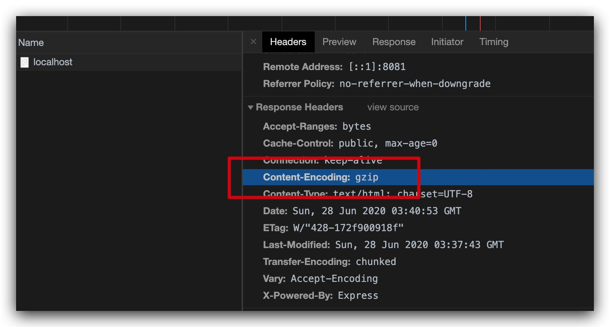

# gzip (gzip)

## 是什么

GZIP最早由Jean-loup Gailly和Mark Adler创建，用于UNⅨ系统的文件压缩。我们在Linux中经常会用到后缀为.gz的文件，它们就是GZIP格式的。现今已经成为Internet 上使用非常普遍的一种数据压缩格式，或者说一种文件格式。(来自 [百度百科](https://baike.baidu.com/item/GZIP))

我们今天主要说的是gzip在[HTTP压缩](https://baike.baidu.com/item/HTTP%E5%8E%8B%E7%BC%A9)方面的使用。

## 为什么

因为是压缩所以好处当然就是降低网络传输的数据量，而提升浏览速度，不过同时也会增加服务器的负担。

## 实现

根据服务器的不同实现`gzip`压缩的方式也不同，我们这里主要就说一下在`Nginx`以及`Node`下的实现。

首先服务器接收到`HTTP`请求之后，会检查`HTTP头`中的`Accept-Encoding`属性，比如如果是`gzip，deflate`就代表浏览器支持`gzip`和`deflate`两种压缩算法。

对于一些比较旧的浏览器不支持就不管他们了。

然后服务器就会根据文件后缀，是否存在之类的返回压缩后的文件，然后在浏览器端就会解压文件然后再展示，具体的细节可以参考上面的链接以及其他各种地方的资料。

### Node

在`Node`中实现可谓是相当的容易，我们这里先使用`express`代理一个静态页面。

```js
const express = require('express')
const app = express()

app.use(express.static('./'))

app.listen(8081, () => {
  console.log('listening on port 8081!')
  console.log('http://localhost:8081')
})
```

然后我们只要再引入一个[`compression`](https://github.com/expressjs/compression)中间件就好了。

```js
// ...
const compression = require('compression')

app.use(compression())
```

然后我们再新建一个`index.html`在里面随意写一些内容，启动服务访问页面。



从图中可以看到`Response`的`Headers`中的`Content-Encoding: gzip`。这个就代表当前这个`html`页面被压缩传输了，可喜可贺。

> 需要注意的是一定要文件里的内容足够多才会被压缩，意思就是说太小的文件不会被压缩，因为也没有必要压缩，具体的大小根据服务器的设置不同而不同。

### Nginx

不愧是`Nginx`没有办法给出太完整的代码例子，这里给出一些配置。

```conf
server {
  # ...

  gzip on;
  gzip_buffers 32 4K;
  gzip_comp_level 6;
  gzip_min_length 100;
  gzip_types application/javascript text/css text/xml;
  gzip_vary on;
}
```

类似上面这种，好吧，这些配置我也没有去仔细在意每个的具体意思，可以稍微参考一下底部的链接。总而言之这样之后也可以获得一样的效果，愉快的看情况使用吧。

## 参考链接

- https://www.techrepublic.com/article/how-to-configure-gzip-compression-with-nginx/
- https://stackoverflow.com/questions/15999606/enable-gzip-compression-with-nginx
- [相关代码](../../code/HTTP/gzip)