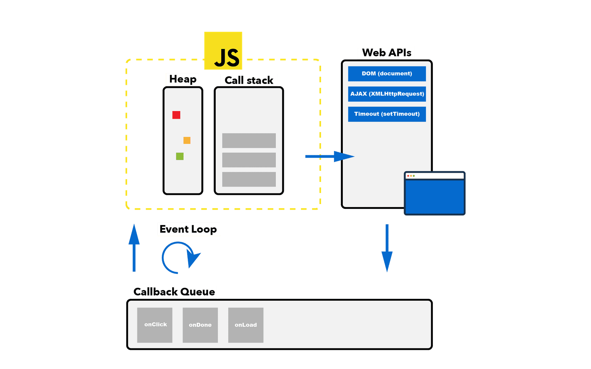

# stack-overflow (栈溢出)

比如现在需要实现一个从1加到n的递归函数。

## 递归

这很简单，大概可以这么写。

```js
function sum(n) {
    if (n === 1) {
        return 1
    }

    return n + sum(n - 1)
}
```

```js
sum(10) // => 55
```

这很不错，然而如果去给他传递一个比较大的数字场面就会很尴尬。

```js
sum(1e5) // => Uncaught RangeError: Maximum call stack size exceeded
```

这通常被称之为栈溢出，根据平台不同溢出的上限不同，不过最终都会溢出，从1万多到5万不等，参考[这里](https://2ality.com/2014/04/call-stack-size.html)。

## 为什么

为什么会这样，大概都听说过JavaScript是单线程语言，他只能一次做一件事情，他只有一个`Call Stack`（调用栈）。

每次函数调用时，他会被压入栈，当他调用完毕后会从栈中移除。

比如调用上面的`sum(10)`的时候，栈大概会长这个样子。

```js
[sum(10), sum(9), sum(8), ..., sum(1)]
```

此时栈中有`10`个函数，然后到达的边界条件，当参数是`1`时`return 1`，于是最后一个函数就执行完毕了，会被从栈中移除。

```js
[sum(10), sum(9), sum(8), ..., sum(2)] // => sum(1)被移除了, 返回1
```

`sum(2)`等于`2 + sum(1)`，于是也能计算出答案，也会被移除。

随后所有的函数都会按照上面的规律一个个执行完毕一个个被移除，调用栈被清空，脚本执行完毕。

而如果传入的是一个特别大的数字，栈就会很大。

```js
[sum(1e5), sum(1e5 - 1), ...] // => 放不下了
```

那么要如何解决这个问题呢。

## 使用迭代

上面递归的思路如果用纯代码写大概是这样。

```js
function sum(n) {
    const stack = []

    while (n > 0) {
        stack.push(n--)
    }

    let result = 0
    while (stack.length) {
        result += stack.pop()
    }

    return result
}
```

因为没有涉及到函数调用所以自然不会影响到调用栈，不过都这么写了为什么不直接用循环，下一个。

## 使用任务队列

当然我们也听说过`Event Loop`，虽然JavaScript本身是单线程的，但是平台也可以同时处理其他任务，我们可以通过Web APIs，或者是Node.js平台提供的接口，去进行异步函数调用。

在调用异步接口的同时，传入一个`Callback`（回调函数），这样那个回调函数就会加入任务队列。

每当主调用栈中的内容全部执行完毕后，便会去任务队列中取得第一个任务。

如此往复，就形成了`Event Loop`，当然任务队列还细分为微任务和宏任务，不过这里先不讨论那些。

> （图片转自参考链接）



我们这里使用`Promise`来创建一个简单的队列。

```js
function sum(n) {
    if (n === 1) {
        return Promise.resolve(1)
    }

    return Promise.resolve(n - 1).then(sum).then(result => result + n)
}
```

这里`Promise.resolve(n - 1).then(sum)`这段代码中的`sum`，因为是在一个`Promise`的`then`后面执行的，所以会被放入异步的任务队列里。

```js
sum(1e5).then(console.log) // => 5000050000
```

这样执行内部的步骤看上去像这样。

1. stack: `[sum(1e5)]` - 第一个函数放入调用栈
2. queue: `[sum(1e5 - 1)]` - 回调函数放入任务队列
3. stack: `[]` - 执行完毕调用栈中的函数，并移除
4. stack: `[sum(1e5 - 1)]` - 从任务队列中取到第一个函数，放入调用栈
5. queue: `[sum(1e5 - 2)]` - 将下一个回调函数放入任务队列
6. ...重复

这样相当于每次调用栈只执行了一次`sum`函数，利用任务队列的特性解决了栈溢出的问题。

## 参考

- [JavaScript 运行机制详解：再谈Event Loop](http://www.ruanyifeng.com/blog/2014/10/event-loop.html)
- [JavaScript Event Loop And Call Stack Explained](https://felixgerschau.com/javascript-event-loop-call-stack/)
- [MDN - Concurrency model and the event loop](https://developer.mozilla.org/en-US/docs/Web/JavaScript/EventLoop)

