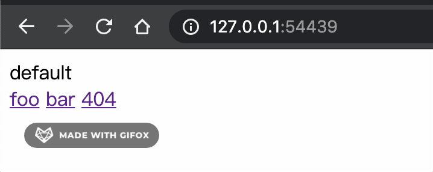
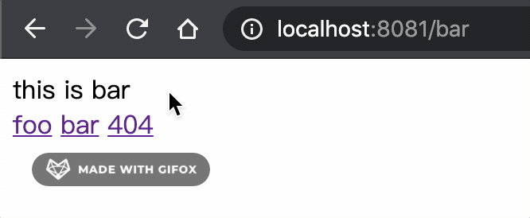

# router-mode (history和hash模式路由的简易实现)

## 是什么

[vue-router](https://router.vuejs.org/)在浏览器环境下有两种可以选择的路由模式，这次来分别了解一下他们的原理并且简单实现一下。

- 默认是`hash`，链接上会有一个`/#/`然后其他内容跟在后面
- 也可以选择`history`，链接看上去和普通的页面链接一样

## 事先准备

```html
<!DOCTYPE html>
<html lang="en">
<head>
  <meta charset="UTF-8">
  <meta name="viewport" content="width=device-width, initial-scale=1.0">
  <title>Router Mode</title>
</head>
<body>
  <div id="router-view"></div>
  <a href="/foo">foo</a>
  <a href="/bar">bar</a>
</body>
<script>
  const RouterMap = {
    'foo': 'this is foo',
    'bar': 'this is bar',
  }

  function useHashRouter () {
    // ...
  }

  function useHistoryRouter () {
    // ...
  }
</script>
</html>
```

准备一个`div`假装里面的内容就是动态的路由页面，我们希望点击`a`标签的时候可以分别实现`hash`路由和`history`路由链接上的效果，再通过路由表去更新`div`里的内容。

## 实现hash路由

我们先从简单的开始，顾名思义，`hash`就是链接中`#`以及之后的一串，并且`hash`里的值无论怎么变化都不会去访问新的页面，即不会出现打出一长串不存在的路径然后然后404的问题。

那我们首先把`a`标签里的链接改一下，顺便也加一个不存在的链接。

```html
<a href="#/foo">foo</a>
<a href="#/bar">bar</a>
<a href="#/404">404</a>
```

现在点击标签`url`已经会变了，接下来只要去监听`url`的变化，可以通过[`onhashchange`](https://developer.mozilla.org/en-US/docs/Web/API/WindowEventHandlers/onhashchange)这个事件。

之后我们在`hash`变化的时候获取链接从路由表找到对应的内容渲染在页面上，大概像这样。另外如果直接输入链接的情况下不会触发`onhashchange`事件我们再额外设置一个`onload`事件。

```js
function useHashRouter () {
  window.onhashchange = renderHashRouter
  window.onload = renderHashRouter
}

function renderHashRouter () {
  // 为了方便考虑这里没有去做边界处理
  render(
    window.location.hash.slice(2)
  )
}

// 渲染内容 路由表没有配置则返回默认文本
function render (routerName) {
  document.getElementById('router-view').textContent = 
    RouterMap[routerName] || 'default'
}
```

然后我们启动一个简单的服务预览一下这个页面。



这样一来就大致实现了`hash`路由的效果，根据实际情况把`render`里面替换成想要的行为就可以实现路由切换的效果了。

## 实现history路由

`history`路由看上去和普通的链接一样，我们先把`a`标签的链接改为想要的形式。

```html
<a href="/foo">foo</a>
<a href="/bar">bar</a>
<a href="/404">404</a>
```

然后基本和预想的一样，随便点一个页面就会跳转，并且会因为没有对应页面导致报了404的问题。

```
Cannot GET /foo
```

所以我们肯定不能再让`a`标签正常跳转，要从他们的点击事件里进行阻止。

```js
function addEvents () {
  document.querySelectorAll('a').forEach(elem => {
    elem.onclick = () => {
      return false
    }
  })
}
```

但是这样一来就连链接也不变了，所以必须要有一种可以变链接但是不跳转的方式，这里我们就可以借助[History API](https://developer.mozilla.org/en-US/docs/Web/API/History)。

```js
// ...
    elem.onclick = () => {
      history.pushState({}, '', elem.href)
      return false
    }
```

加上了这样一段之后，就可以得到链接变，页面不跳转的效果了，因为没有需要保留的状态我们这里也不加状态。

然后接下来我们要做的就是在点击链接之后，以及后退前进之类的情况能够让页面渲染我们想要的内容。刚刚的`hash`模式下各种情况都能触发`onhashchange`事件，而对于现在来说则需要[onpopstate](https://developer.mozilla.org/en-US/docs/Web/API/WindowEventHandlers/onpopstate)这个事件，在`history`状态变化的时候触发。

```js
function useHistoryRouter () {
  addEvents()
  window.onload = renderHistoryRouter
  window.onpopstate = renderHistoryRouter
}

function addEvents () {
  document.querySelectorAll('a').forEach(elem => {
    elem.onclick = () => {
      history.pushState({}, '', elem.href)
      renderHistoryRouter()
      return false
    }
  })
}

function renderHistoryRouter () {
  // 这里为了方便没有做边界处理
  render(
    window.location.href.split('/').slice(-1)[0]
  )
}
```

好的，这样一来我们的各种操作页面都不会跳转，并且可以根据我们的需要渲染路由内容了。

但是有一个问题就是万一我们直接输入路由的地址，则不会加载最初的`HTML`文件，而会报一个404。所以也就如同`vue-router`里这边对[`History Mode`](https://router.vuejs.org/guide/essentials/history-mode.html)所描述的，需要服务端进行一些配合才行，把所有匹配不到的路径全部重定向成默认页面。

具体根据服务端的不同进行不同设置，我们这里简单的使用`Nodejs`来演示一下。

```js
const http = require('http')
const fs = require('fs')
const httpPort = 8081

http.createServer((req, res) => {
  fs.readFile('index.html', 'utf-8', (err, content) => {
    if (err) {
      console.log('We cannot open "index.html" file.')
    }

    res.writeHead(200, {
      'Content-Type': 'text/html; charset=utf-8'
    })

    res.end(content)
  })
}).listen(httpPort, () => {
  console.log('Server listening on: http://localhost:%s', httpPort)
})
```



这样一来也就实现出了简易的`history`效果，可喜可贺。

## 总结

- 总而言之`hash`模式是纯前端就可以达成的比较方便的模式，但是不太漂亮（其实也还好）。
- 然后如果追求`history`模式则需要服务端的支持，然后主要是基于`History API`的实现。

## 参考

- [History API](https://developer.mozilla.org/en-US/docs/Web/API/History)
- [History Mode](https://router.vuejs.org/guide/essentials/history-mode.html)
- [相关代码](../../code/Vue/router-mode/index.html)